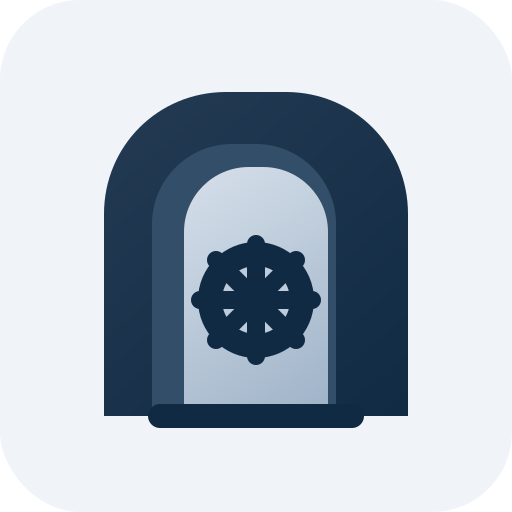

<p align="center">
  
</p>

# Bunker46 on StartOS

> **Upstream repo and docs:** <https://github.com/dsbaars/bunker46>

Bunker46 is a self-hosted NIP-46 Nostr key management service. It stores nsec keys encrypted on the server and signs requests remotely, so Nostr clients can use delegated signing without receiving the private key.

This package builds Bunker46 from source using the pinned upstream ref in the package Dockerfiles. The package manifest and Dockerfiles are the source of truth for image tags, upstream pins, supported architectures, and StartOS package version metadata.

---

## Table of Contents

- [Image and Container Runtime](#image-and-container-runtime)
- [Volume and Data Layout](#volume-and-data-layout)
- [Installation and First-Run Flow](#installation-and-first-run-flow)
- [Configuration Management](#configuration-management)
- [Network Access and Interfaces](#network-access-and-interfaces)
- [Actions](#actions)
- [Backups and Restore](#backups-and-restore)
- [Health Checks](#health-checks)
- [Dependencies](#dependencies)
- [Limitations and Differences](#limitations-and-differences)
- [What Is Unchanged from Upstream](#what-is-unchanged-from-upstream)
- [Contributing](#contributing)
- [Quick Reference for AI Consumers](#quick-reference-for-ai-consumers)

---

## Image and Container Runtime

| Image ID | Source | Purpose |
| --- | --- | --- |
| `db` | PostgreSQL image from the manifest | Database |
| `valkey` | Valkey (Redis-compatible) image from the manifest | Live-update pub/sub used by upstream |
| `server` | Local Docker build | NestJS/Fastify API built from upstream source |
| `web` | Local Docker build | Vue SPA served by Caddy |

Supported StartOS package architectures are `x86_64` and `aarch64`.

The four subcontainers share a single network namespace, so they reach each other over `127.0.0.1`. The web container uses `Caddyfile.startos` to serve the SPA and reverse-proxy `/api` to the API process on `127.0.0.1:3000`; the SPA itself calls the API with relative `/api` paths, so the browser, the SPA, and the API are all same-origin behind the StartOS interface URL. This replaces upstream's Docker Compose service DNS with the StartOS subcontainer network model.

The server container uses a StartOS wrapper entrypoint before upstream's entrypoint. On existing StartOS installs created before upstream adopted Prisma migrations, the wrapper marks upstream's initial Prisma migration as already applied, then lets upstream's `prisma migrate deploy` run the data-preserving migrations. Fresh installs skip the baseline step and run the full upstream migration chain normally.

## Volume and Data Layout

| Volume | Path | Purpose |
| --- | --- | --- |
| `db` | mounted at `/var/lib/postgresql`; PostgreSQL writes its data dir under `data/` | PostgreSQL data |
| `startos` | `store.json` at volume root | StartOS-managed generated secrets |

`store.json` contains the generated PostgreSQL password, JWT secret, refresh-token secret, Bunker46 encryption key, and the registration toggle. The secrets are backed up with the `startos` volume and must remain stable for encrypted nsec data to stay readable. `store.json` is read host-side by StartOS and injected into the API as environment variables — no subcontainer mounts it.

## Installation and First-Run Flow

1. StartOS initializes the service volumes and creates `store.json` if it does not already exist.
2. Stable runtime secrets are generated and preserved across restarts, backups, and restores.
3. PostgreSQL and Valkey start first.
4. The API starts after the database and Valkey are ready, then runs upstream's Prisma migrations (`prisma migrate deploy`) through the server entrypoint.
5. The web UI starts after the API is listening.
6. The user opens the Web UI and creates the first account in Bunker46's own sign-up screen. Registration is off by default, but upstream allows the first account to be created while no accounts exist.
7. The user logs in, imports or creates Nostr keys, and creates NIP-46 connections.

## Configuration Management

There is no StartOS user-facing config screen. Most Bunker46 settings are managed in the upstream web UI. The first account is created through Bunker46's own sign-up screen; password recovery is handled by the **Reset Account Password** action, and open sign-ups are toggled with the **Registrations** action (see [Actions](#actions)).

StartOS supplies these runtime values to the API container:

| Variable | Source / Value |
| --- | --- |
| `NODE_ENV` | production |
| `PORT` | API port |
| `HOST` | all container interfaces |
| `DATABASE_URL` | generated PostgreSQL password and local database endpoint |
| `JWT_SECRET` | generated and persisted in `store.json` |
| `JWT_EXPIRES_IN` | access-token lifetime |
| `JWT_REFRESH_SECRET` | generated and persisted in `store.json` |
| `JWT_REFRESH_EXPIRES_IN` | refresh-token lifetime |
| `ENCRYPTION_KEY` | generated and persisted in `store.json` |
| `CORS_ORIGINS` | local web interface origin |
| `REDIS_URL` | local Valkey endpoint |
| `WEBAUTHN_RP_NAME` | Bunker46 |
| `WEBAUTHN_RP_ID` | localhost |
| `WEBAUTHN_ORIGIN` | local web interface origin |
| `LOG_LEVEL` | info |
| `ALLOW_REGISTRATION` | persisted in `store.json`; toggled by the Registrations action (default disabled) |
| `COOKIE_SECURE` | false, so upstream's httpOnly refresh cookie works on standard StartOS HTTP interface URLs |
| `TRUST_PROXY` | enabled for StartOS proxy headers |

## Network Access and Interfaces

| Interface | Port | Protocol | Purpose |
| --- | ---: | --- | --- |
| Web UI | 8080 | HTTP | Bunker46 dashboard and API proxy |

Access methods are the standard StartOS interface URLs: LAN IP with unique port, mDNS hostname, Tor onion, or custom domain if configured.

## Actions

| Action | Purpose |
| --- | --- |
| Reset Account Password | Generate a new password (shown once) for an existing account, chosen from a dropdown of the current accounts built at run time from the database. Upstream has no forgotten-password flow and passkeys are address-bound, so this is the supported recovery path when a user is locked out. It hashes the new password with the app's own argon2 in a throwaway container and writes it directly to PostgreSQL; no service restart is needed. |
| Registrations | Enable or disable open new-user sign-ups. The action label and warning update to reflect the current state. The toggle is persisted in `store.json` and applied to the API's `ALLOW_REGISTRATION` (which gates registration in both the backend and the web UI) on the next service start. |

Registration is **disabled by default**. The upstream first-account bootstrap path still exposes the sign-up form while no accounts exist, then subsequent new-user registration stays closed unless the user explicitly enables it with **Registrations**.

## Backups and Restore

The package dumps the PostgreSQL database with `pg_dump` (the `db` volume) and backs up the `startos` volume, which holds `store.json`. StartOS stops the service for the duration of the backup, so the dump runs against a quiescent database.

Restore behavior: backups are restored before the service starts. The package preserves restored secrets rather than regenerating them. Restoring both the database and `store.json` is required for stored nsec keys to remain readable.

## Health Checks

| Check | Method | Visibility | Purpose |
| --- | --- | --- | --- |
| PostgreSQL | `pg_isready` | Internal (hidden) | Startup gate for the API |
| Valkey | `valkey-cli ping` | Internal (hidden) | Startup gate for the API |
| API Server | Port listening | Shown | Confirms the API process is accepting connections |
| Web Interface | Port listening | Shown | Confirms the Caddy web UI is accepting connections |

The PostgreSQL and Valkey checks are internal startup-ordering gates and are hidden from the StartOS health UI; the API Server and Web Interface checks are surfaced to the user.

## Dependencies

None.

## Limitations and Differences

1. **No StartOS config screen** - settings are managed in the Bunker46 UI; the first account is created in the web UI sign-up, password recovery uses the Reset Account Password action, and open sign-ups use the Registrations action.
2. **Passkeys/WebAuthn need a fixed website address** - a passkey is tied to one exact website address, while StartOS can expose the same service through several addresses. Username/password login (recoverable with the Reset Account Password action), TOTP, and NIP-46 signing do not depend on that passkey setting.
3. **Source pin lives in Dockerfiles** - upstream does not publish release tags, so the package Dockerfiles pin a specific upstream ref.

## What Is Unchanged from Upstream

The NIP-46 protocol implementation, user management, key management, relay settings, connection permissions, signing logs, Prisma migrations, and web UI are built from upstream source without application-code patches.

The package changes only the StartOS runtime wrapper: manifest metadata, image build definitions, daemon ordering, generated runtime secrets, persistent volume layout, interface export, Caddy API proxy target, upgrade migration baselining, backups, the password-reset and registration actions, and documentation.

## Contributing

See [CONTRIBUTING.md](CONTRIBUTING.md) for local build, validation, versioning, and release workflow notes.

## Quick Reference for AI Consumers

```yaml
package_id: bunker46
upstream: https://github.com/dsbaars/bunker46
architectures: [x86_64, aarch64]
images:
  db: manifest dockerTag (postgres)
  valkey: manifest dockerTag (valkey)
  server: dockerBuild
  web: dockerBuild
volumes:
  db:
    postgres: /var/lib/postgresql (data under data/)
  startos:
    store_json: generated package secrets + registration toggle
ports:
  ui: 8080
  api: 3000
  postgres: 5432
  valkey: 6379
actions:
  - reset-password  # reset a lost password (dropdown of accounts)
  - registrations   # toggle open sign-ups (off by default)
dependencies: none
startos_managed_env_vars:
  - DATABASE_URL
  - JWT_SECRET
  - JWT_REFRESH_SECRET
  - ENCRYPTION_KEY
  - REDIS_URL
  - ALLOW_REGISTRATION
  - COOKIE_SECURE
```
